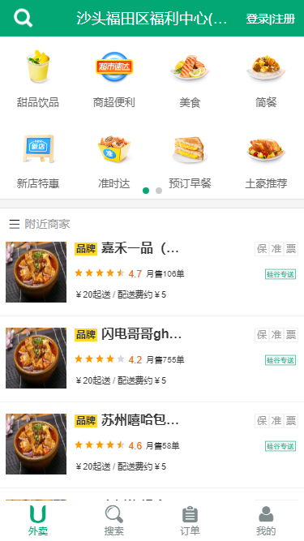
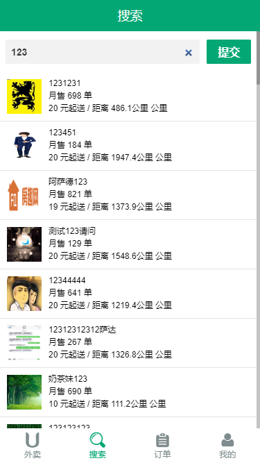
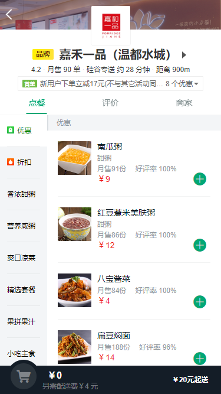
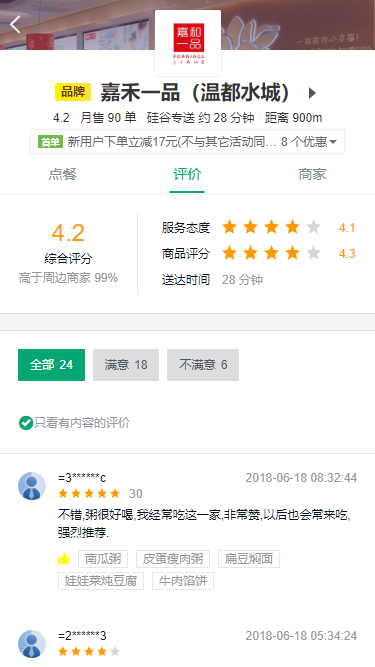
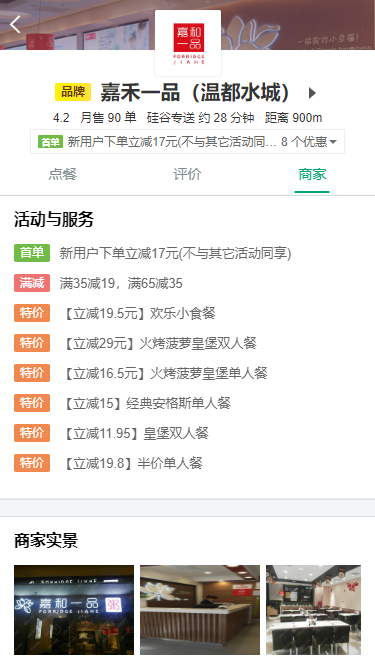
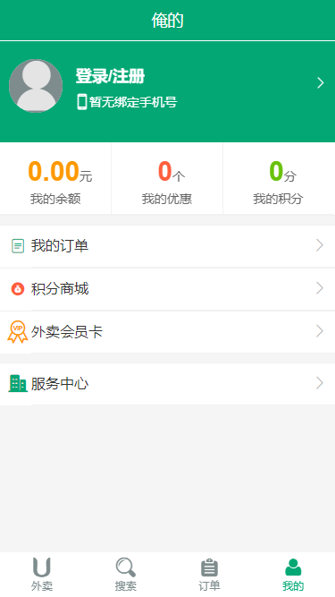
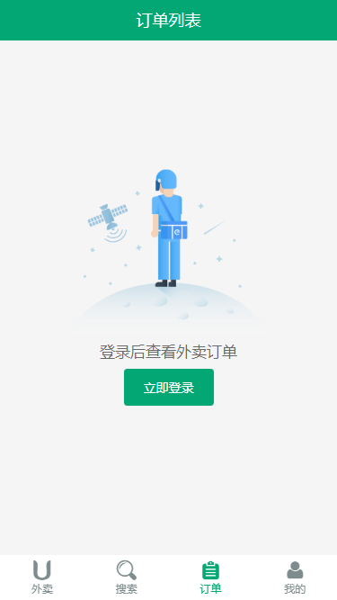
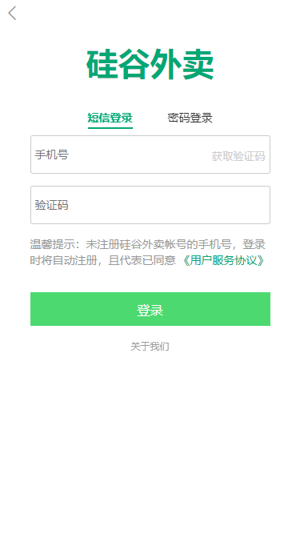

---

---


# 项目截图

### 首页



### 搜索



### 商家点餐



### 商家评价



### 商家信息



### 个人信息




### 订单



### 登录




# 外卖

## 运行开发

1.先打开mongod数据库(得要现行安装)---直接用命令提示符输入`mongod`

2.打开后台服务---右键后台gshop-server_final文件夹终端打开运行---`npm start`

3.打开前台网页---右键前台gshop文件夹终端打开运行---`npm run dev`

## 资源准备

**图标字体**

iconfont字体图标

如果项目没有 准备, 则去 **阿里巴巴字体图标库** 下载, 再放入**项目字体图标文件夹**

**CSS初始化**

使用reset.css初始化页面基本属性

------


# 项目工具

> 打包工具webpack4.0,Vue框架
> axios、vue-router、vuex
> mint-ui组件库、swiper轮播数据、better-scroll移动端滚动插件、date-fns日期工具、fastclick清除点击延迟、mockjs拦截 Ajax 请求

------


# 项目结构

## 底部 FooterGuide组件

是整个项目起手的重点, 底部的"外卖,搜索,订单,我的"分出三个路由组件, 再从中拆分出通用组件(顶部HeaderTop),和如首页的商品列表组件

使用`:class="{on: '/msite'===$route.path}"`实现点击对应路由组件 高亮

## 顶部 HeaderTop组件

1. 封装成通用组件
2. 对应底部组件名字 使用slot插槽 改变标题名称

### 外卖

1. swiper轮播数据
2. 附近商家列表

### 搜索

1. 搜索功能
2. 搜索列表

### 订单

1. 显示立即登录
2. 登录后可查看订单

### 我的

1. 显示登录|注册,如登录则显示个人信息
2. 我的余额,我的优惠,我的积分
3. 功能列表

### 登录

1. 路由跳转`router-link`
2. 返回按钮, 给a标签 添加`@click="$router.back()"`
3. 要设置height:100%;然后覆盖全屏(需要看笔记练习=>常见问题=>Vue组件height100%无效)
4. 设置**底部 FooterGuide组件**隐藏
   - 设置`<FooterGuide v-show="$route.meta.showFooter" />`
   - 给需要的路由添加`meta: {showFooter:true}` login不用,因为默认就是有false了

## 封装ajax请求函数

**ajax.js**封装请求函数

使用axios和promise

## 封装接口请求函数

**api.js**封装请求接口

## vuex的使用

> 用来获取并保存从接口得来的数据

### 准备流程

1. 封装 `ajax请求函数` 及 `接口请求函数` action为主要使用对象
2. `npm i vuex -S`
3. 新建文件目录

- **store**（数据管理文件夹）
  - **actions.js**（通过操作`mutation`间接更新`state`的多个方法（异步操作））
    - `action`调用了`ajax.js`异步获取数据,再提交数据到`mutation`存储到`state`
  - **getters.js**（基于`state`的`getter`计算属性,对数据进行'过滤'（计算属性））
  - **index.js**（管理对象`store`,组装模块并导出 `store` 的地方（出入口））
    - 引入模块, 声明使用`vuex`, 暴露全局使用所有模块
  - **mutation-types.js**（适用于多人协作的大型项目,中小型项目可有可无）
    - 其实就是一个"常量"名字而已, 把`mutations`方法名字都放到了一起
  - **mutations.js**（操控数据变化(增减,更新),接受数据并处理数据（同步操作））
    - 接收`action`异步获取的数据,将数据存储到`state`中
  - **state.js**（数据的仓库, 存放数据信息（数据仓库））

4. 模块文件内有注释和具体使用方法
5. 在main.js中引入`import store from "./store"`并在Vue实例中挂载使用store

### 使用步骤

**最简单的情况**

1. 发送请求获取数据
   - 在组件中 触发action获取到数据
   - 方法一：
     - `mounted() {this.$store.dispatch('getAddress')}`
   - 方法二：
     - `import { mapActions } from "vuex";`
     - `methods: { ...mapActions(["getAddress"]) }`
     - `mounted() { this.getAddress() }`
2. 读取stata数据状态
   - `	computed: { ...mapState(['address']) }`
3. 写入模板,在页面中显示
   - `<HeaderTop :title="address.name"></HeaderTop>`

**复杂情况**

1.循环渲染

- 当出现列表样式时, 就需要v-for循环渲染

2.watch监控数据获取时机渲染

- 使用setTimeout()定时
- 或者使用Vue的api   vm.$nextTick( )在修改数据之后立即使用它，然后等待 DOM 更新。

**模板中数据的来源**

data：自身的数据（内部改变，也就是组件自己的数据）

props：外部传入的数据（外部改变，子组件接收父组件传来的数据）

computed：根据data/props/别的compute/state/getters（可以互相作用）

------

### 改善用户体验

使用svg显示加载中提示界面,让数据未到时的界面更友好

**轮播数据图**

```HTML
<div>
  <!-- v-if判断是否已经获取到数据 -->
  <div v-if="categorys.length"></div>
  
  <!-- v-else如没有数据则显示图片 -->
  
</div>
```

**商家列表**

```html
<!-- v-if判断是否已经获取到数据 -->
<ul v-if="shops.length">
  <li v-for="shop in shops" :key="shop.id"></li>
</ul>

<!-- v-else如没有数据则显示图片. -->
<ul v-else>
  <!-- 这里还需要循环一下,但是可以简写 -->
  <li v-for="item in 6" :key="item.i"></li>
</ul>
```


------

## 封装五星评分

> gshop\src\components\Star\Star.vue

由于星星评分，在项目中出现的次数较多，所以将封装该组件

需要父组件传值

父组件获取评分数据传入子组件=>

```html
<!-- 星星评分 -->
<Start :score="shop.rating" :size="24"></Start>
```

子组件接收数据渲染星星评分

```js
export default {
  props: {
    score: Number,
    size: Number
  }
}
```

具体方法查看源代码,或者Vue案例笔记

## 封装提示框

在登陆界面需要频繁使用到，判断表单数据输入格式是否正确，错误则弹窗

> gshop\src\components\AlertTip\AlertTip.vue

------

## 登录功能

### 前台功能及校验

> gshop\src\pages\Login\Login.vue

**切换登录方式**

- 用class绑定属性，和click点击事件实现登录方式隐藏切换

```html
<!-- 点击触发事件切换 -->
<a ... :class="{on:loginWay}" @click="loginWay=true">短信登录</a>
<a ... :class="{on:!loginWay}" @click="loginWay=false">密码登录</a>

<!-- 根据上面切换 绑定样式切换 -->
<div :class="{on:loginWay}">短信登录的界面</div>
<div :class="{on:!loginWay}">密码登录的界面</div>
```

**手机号合法检查**（一旦合法，发送验证码的 按钮则会亮起来）

- 使用v-model表单输入绑定，添加computed计算属性 监控手机号输入结果（用正则表达式匹配），判断布尔值，true的话，即按钮样式生效，同时button的disabled禁用功能取非

```html
元素中添加v-model和:class
<input ... v-model="phone" />
<button ... :disabled="!rightPhone" :class="{right_phone:rightPhone}">获取验证码</button>

添加计算属性
	computed: {
    rightPhone(){
      return /^1\d{10}$/.test(this.phone)//监控手机号输入是否正确
    }
  }

样式里加一个兄弟样式 right_phone 注意必须是下划线...
.login-verification-get {
  position: absolute;
  right: 0;
  top: 15%;
  &.right_phone{//用了&就可以写在兄弟样式里面了
    color: black;
  }
}

```

**倒计时效果**（获取验证码的倒计时，时间到了可再次发送）

- 添加点击事件（注意，要使用@click.prevent组织表单提交且刷新页面的默认行为）
- 注意`${computedTime}`可以显示`computedTime`里的数据

```html
<template>
<button
  :disabled="!rightPhone"
  class="login-verification-get"
  :class="{right_phone:rightPhone}"
  @click.prevent="getCode"
>{{computedTime>0?`已发送(${computedTime}s)`:'获取验证码'}}</button>
</template>

<script>
export default {
  data() {
    return {
      loginWay: true,
      phone: "",
      computedTime: 0//初始化倒计时事件,并存储到data
    };
  },
  computed: {
    rightPhone() {
      return /^1\d{10}$/.test(this.phone);
    }
  },
  methods: {
    //这个点击事件,出现了页面表单提交行为,导致页面刷新了一下,要去点击位置设置@click.prevent阻止这个默认行为
    // 点击倒计时(使用setInterval循环定时器,因为之后可能再次需要倒计时)
    getCode() {
      // 必须要先判断当前没有计时器(也就是this.computedTime为0时),才可以触发该事件,不然有BUG
      if (!this.computedTime) {
        this.computedTime = 30; //初始化倒计时为30秒
        const intervalId = setInterval(() => {
          this.computedTime--;
          if (this.computedTime <= 0) {//到0了就清除这个定时器
            clearInterval(this.intervalId);
          }
        }, 1000);
      }
    }
  }
};
</script>
```

**切换显示或隐藏密码**

具体可以查看项目,或者Vue经典案例中的switch开关

- 使用mint-ui的Switch,绑定v-model、v-if、v-else
  - Switch已经为弄好了相关的功能，直接将布尔值传入 v-model 即可

```html
<section class="login-message">
  <input type="text" maxlength="8" placeholder="密码" v-if="showPwd" v-model="pwd" />
  <input type="password" maxlength="8" placeholder="密码" v-else v-model="pwd" />
  
  <mt-switch class="switch_text" v-model="showPwd">
    <span class="switch_text" v-if="showPwd">显示</span>
    <span class="switch_text" v-else>隐藏</span>
  </mt-switch>
  
</section>
```

- 或者手动写开关样式

**前台验证提示**

- 为登录form表单输入添加`@submit.prevent="login"`(提交submit.prevent()提交表单内容且阻止默认行为) ---好像不加也行
- 为登录按钮添加 @click.prevent="login"点击事件，并在methods中添加登陆前台校验方法
- 需要封装一个提示框组件（可以用mint-ui，也可以自己封装）mint-ui的样子不太好看，要改很多，不如自己封装，具体方法看项目，或者看笔记Vue经典案例=>自定义组件
  - gshop\src\components\AlertTip\AlertTip.vue

### 前后台交互功能

**动态一次性图片验证码**

直接将 一次性图片验证码src链接 写在img的src上，就可以获取图片了（但需要刷新页面才会刷新）

在methods中定义一个方法，每点击图片一次，就更新图片

- 注意!!!!!!!!!!!!!!!!!注意这个 `ref` ,他类似于Vue专属的DOM操作
- 在元素中添加`ref="指定名字"`
- 在方法中`this.$refs.指定名字.src` 获取该DOM元素（可以拿到里面的src、alt、什么的）

```html
<template>
<section class="login-verification">
  <input type="text" maxlength="8" placeholder="验证码" v-model="captcha" />
  
</section>
</template>

<script>
getCaptcha() {
  // 要保证每次指定的src不一样，这里使用"?time="来拼接Date.now()的方法
  this.$refs.captcha.src =
    "http://localhost:4000/captcha?time=" + Date.now();
}
</script>
```

**动态一次性短信验证码**

设置好ajax的req请求（也就是api/index.js）之后再取vuex中引用获取数据

**短信登录**

- 准备

1. 注册登录**容联云通讯**，教程为`38_Vue项目_登陆_发送短信验证码`
2. 管理=>测试号码=>平台测试号码=>添加测试手机号
3. 到后台服务端的`my\gshop-server_final\util\sms_util.js`文件中将那四个参数输入到对应位置即可

- 这次选择在对应组件中发送ajax请求,不在vuex的action里
- 将用data户信息存储在vuex中, 再跳转到 上一级（也就是点击登陆的页面）显示用户头像等信息

**密码登录**

- 与短信登录相似,且一同处理

**获取用户信息,实现自动登录**

- 在action中定义好getUserInfo异步获取session会话中的信息(根据api接口定义)
- 从session会话中获取数据(使用vuex的action的异步获取)
- 在App.vue使用`getUserInfo`

**退出登录**

使用mint-ui,建议使用按需打包（但我这里用了全部导入）


------

## 搜索

> my\gshop\src\pages\Search\Search.vue

**在api的ajax封装好请求方法**

- 这里要注意,在api/index.js中设置请求方法，这里的传值不能用{}包起来,因为两个参数是分开传输的  如下
- `export const reqSearchShop = (geohash, keyword) => ajax(BASE_URL + '/search_shops', { geohash, keyword })`
- geohash和keyword不能{}包在一起传输，不然获取经纬度地址就会出错

使用vuex完成剩下操作（详情可看项目文件my\gshop\src\store）

**搜索输入**

- 给包裹搜索的form表单添加提交`@submit.prevent="search"`并阻止默认提交刷新页面行为
- 添加input数据内容绑定`v-model="keyword"` 
- 注意：两个input 一个为填写内容`type="search"`一个为提交按钮`type="submit"`

```html
<form class="search_form" @submit.prevent="search">
  <input type="search" placeholder="请输入商家名称" class="search_input" v-model="keyword" />
  <input type="submit" class="search_submit" />
</form>
```

定义搜索方法

```js
methods: {
  // 方法:搜索
  search() {
    // 1.获取搜索关键字并trim()去空格
    const keyword = this.keyword.trim();
    // 2.根据关键字搜索(如果内容非空)
    if (keyword) {
      // 3.使用vuex的action发送异步请求搜索结果且将数据存入state(传入搜索关键字)
      this.$store.dispatch("getSearchShops", keyword);
      // 4.在用户提交form表单信息时触发(记得要阻止默认表单提交刷新页面的行为)
    }
  }
},
```

**搜索列表**

- 遍历循环搜索内容，展示在搜索列表中
- 注意：因为这里的每个搜索项`li`都是可以点击的 从而要改成`<router-link`,且加上`tag="li"`在页面中显示为`li`（不加上的话默认是`a`）
- 点击后路由跳转进入相关搜素的商家中
  - 添加`:to="{path:'/shop',query:{id:item.id}}"`
  - 或者`:to="'/shop?id='+item.id"`
  - 二者都一样
- 这里需要注意，如果查看vue插件看不到搜索内容，和点击searchShops内显示根据经纬度获取内容失败，则可能就是api/index.js中设置请求方法出问题，这里的请求方法传值不能用{}包起来,因为两个参数是分开传输的

```html
<ul class="list_container">
        <!-- to路由跳转也可以写成:to="'/shop?id='+item.id" -->
        <router-link
          tag="li"
          :to="{path:'/shop',query:{id:item.id}}"
          class="list_li"
          v-for="item in searchShops"
          :key="item.id"
        >
        </router-link>
</ul>
```

**无搜索结果**

data中添加`noSearchShops: false // 是否显示"无搜索结果"`

设置`搜索列表v-if` 和 `无搜索结果v-else`

在watch中观察数据变化

```js
watch: {
  // 观察:是否显示"无搜索结果"
  searchShops(value) {
    // 1.没有数据
    if (!value.length) {
      // 2.显示
      this.noSearchShops = true;
      // 3.有数据
    } else {
      // 4.不显示
      this.noSearchShops = false;
    }
    // 5.时刻观察
  }
}
```


## 制作商家页面

> my\gshop\src\pages\Shop\Shop.vue

### 分析结构(拆分)

**上**(Header组件)----------**中**(三个点击组件)----------**下**(Food组件)

> 这里其实有个问题 该案例只实现了一个商业页面,点击其他的商家也是同一个页面

my\gshop\src\pages\Shop\Shop.vue

1. 先根据设计稿,分析页面需要拆分的路由,再根据分出的路由创建组件文件,和路由配置

点击（点餐、评价、商家）显示高亮+下划线------通过样式实现 `router-link-active`

具体实现看项目或者看笔记vue经典案例

- 这里需要注意的是如果路由地址请求的是`/shop/`就会出现空的页面,所以需要设定一个`redirect: '/shop/goods'`

到ShopList.vue中设置点击商家路由跳转`@click="$router.push('/shop')"`

- push()能后退,replace()不行

2. 制作基本页面结构
3. 设计json数据=>使用mockjs数据模拟接口数据

**mockjs**

> 让前端攻城师独立于后端进行开发。(自制数据接口)
>
> `npm install mockjs`

- main.js引入`import './mock/mockServer'`
- vuex操作
  - api文件夹中的index.js添加相应的req请求,下面步骤的actions.js会用到
  - state.js---mutations.js---mutation-types.js---actions.js

### 上(Header组件)

> 分离该组件单独制作my\gshop\src\components\ShopHeader\ShopHeader.vue

根据路由拆分出的组件制作 基本相应静态页面

**引入数据/渲染**

```html
<script>
import { mapState } from "vuex";

export default {
  computed: {
    ...mapState(["info"])
  }
};
</script>
```

1. 动态渲染背景图片（绑定样式）

```html
<nav class="shop-nav" :style="{backgroundImage:`url(${info.bgImg})`}"></nav>
```

2. 动态渲染图片src链接

```html

```

3. 三层表达式的问题（这里 supports 是数组）

由于是异步获取数据,三层表达式(info.supports[0].type)容易出问题，v-if验证数据是否已接受

平时使用的二层表达式`info.name`则不会出现这个问题

```html
<div class="shop-header-discounts" v-if="info.supports"></div>

```

- 这里的优惠标签有三种颜色 使用:class样式绑定 type作为索引值[i]判断是哪个样式

```html
<div class="activity" :class="supportClasses[info.supports[0].type]"></div>

```

**点击事件**

> 设置**显示店家详情的点击事件**和**显示优惠活动的点击事件**

- 动态数据渲染这些页面
- 优惠活动列表需要循环渲染, 注意也是需要判断优惠标签的颜色
- 项目示例

```html
<ul class="list">
  <li
    class="activity-item"
    v-for="(item,i) in info.supports"
    :key="i"
    :class="supportClasses[item.type]"
  >
    <span class="content-tag">
      <span class="mini-tag">{{item.name}}</span>
    </span>
    <span class="activity-content">{{item.content}}</span>
  </li>
</ul>

```

**点击淡入淡出动画**

页面结构

```html
<template>
	<transition name="fade"><!-- 设置name 然后去设置动画样式 -->
  	<div class="animation" v-show="shopShow">
      <div @click="toggleShopShow">点击触发动画</div>
    </div>
	</transition>
</template>

```

触发动画事件（可自定义，这里是靠点击触发）

```html
<script>
export default {
  data() {
    return {
      shopShow: false
    };
  },
  methods: {
    toggleShopShow() {
      this.shopShow = !this.shopShow;
    }
  }
};
</script>

```

基本动画样式(需要自己补充)

```html
<style lang="scss" scoped>
    .animation {
    &.fade-enter-active,
    &.fade-leave-active {
      transition: opacity 0.5s;
    }
    &.fade-enter,
    &.fade-leave-to {
      opacity: 0;
    }
  }
<style>

```

### 中(三个点击组件)

my\gshop\src\pages\Shop\Shop.vue

基本静态页面制作引入

> ShopGoods.vue点餐、ShopInfo.vue评价、ShopRatings.vue商家

分别设置设置点击路由, 注意要加 **replace** 不然点击后退 不能一定返回上一级页面，而是在这几个路中返回切换

```html
<div class="tab">
  <div class="tab-item">
    <router-link to="/shop/goods" replace>点餐</router-link>
  </div>
  <div class="tab-item">
    <router-link to="/shop/info" replace>评价</router-link>
  </div>
  <div class="tab-item">
    <router-link to="/shop/ratings" replace>商家</router-link>
  </div>
</div>

```


### 下(ShopGoods组件)

#### 滑动

需要使用BetterScroll制作滑动

官方文档：http://ustbhuangyi.github.io/better-scroll/doc/installation.html

教程地址：https://www.bilibili.com/video/av24104609/?p=54

安装

```shell
npm install better-scroll --save

```

引入(在需要使用的组件中)

```
import BScroll from 'better-scroll'

```

使用

1. 功能：
   - 实现左右2个列表滑动
   - 当前分类
   - 当滑动右侧列表时, 更新当前分类
   - 点击某个分类项,右侧列表滑动到对应位置
2. 分析：
   - 类名：current 标识当前点击分类
   - 设计一个计算属性：currentIndex（点击相应食品列表 滑动到相应区域）
   - 根绝哪些数据计算?
     - scrollY：右侧滑动的Y轴坐标（滑动过程时实时变化）
     - tops：所有右侧分类li的top组成的数组（列表第一次显示后就不再变化）
3. 编码：
   - 在滑动过程中，实时收集scrollY
   - 列表第一次显示后，收集tops
   - 实现currentIndex计算逻辑

**better-scroll的步骤**

> 顺序
>
> 准备.data中设置好scrollY: 0、tops: []
>
> 一.要定义methods方法
>
> 二.初始化滚动_initScrooll()----初始化tops_initTops()
>
> 三.在mounted()钩子中调用,且使用$nextTick()在DOM元素创建数据更新后才执行
>
> 四.在computed计算属性中解决右边滑动，左边列表跟着变动的效果
>
> 五.点击左列表，右列表自动滑动，clickMenuItem()
>
> 具体使用看项目注释 my\gshop\src\pages\Shop\ShopGoods.vue

**currentIndex的bug解决**

解决惯性滑动不触发currentIndex的问题

方法一

直接将 `初始化滚动方法_initScrooll()` 中的probeType改为3

方法二

给`_initScrooll()`添加scroll结束的监听

```js
foodsScroll.on("scrollEnd", ({ x, y }) => {
  console.log("scrollEnd", x, y);
  this.scrollY = Math.abs(y);
});

```

**注意click: true**

需要在初始化滚动内添加`click: true` 对应区域的点击才能生效

```js
methods: {
  // 初始化滚动方法
  _initScrooll() {
    // 初始化左侧列表滚动
    new BScroll(".menu-wrapper", {
      // 允许触发click点击事件
      click: true
    });
  }
}

```

**注意this.方法名**

让一个方法,可以被另一个方法找到并使用

```js
// 本是const foodsScroll改为this.foodsScroll
// 为了能在另外一个方法中找到这个属性,如下面的clickMenuItem点击方法
this.foodsScroll = new BScroll(".foods-wrapper", {
  // 允许触发click点击事件
  click: true
});

```

为了能在**clickMenuItem点击方法**中使用foodsScroll（因为右列表滑动是它控制的）

```js
clickMenuItem(i) {
  const scrollY = this.tops[i];
  this.scrollY = scrollY;
  // 这里需要获取并控制右侧列表this.foodsScroll滑动距离
  this.foodsScroll.scrollTo(0, -scrollY, 300);
}

```


#### 增减按钮

- 封装制作通用组件：CartControl.vue
- 在食品组件引入使用：ShopGoods.vue

用点击click事件updateFoodCount(布尔值)判断是点了`+号`还是`-号`

需要使用vuex  处理增减

蛮复杂的最好多复习下https://www.bilibili.com/video/av24104609/?p=61

> 顺序
>
> 准备好封装组件的props，和vuex中的state、mutation-types.js
>
> 一、封装通用组件并在父组件中引入使用
>
> 二、设置props接收父组件传值，并添加点击事件，分别设置booleans传值判断 `+-`
>
> 三、数据涉及到购物车，需要使用vuex，在action中同步更新food的count值,判断是提交一个增加的mutation，还是提交一个减少的mutation
>
> 四、在mutation中进行增减数据处理存储，由于一开始数据是空的，新增数据无绑定同步效果，用Vue.set(对象，属性名,属性值)解决

点击按钮滑动动画 

可查看项目文件

> my\gshop\src\components\CartControl\CartControl.vue

或者 笔记

> xera-2011\8.练习\Vue经典案例\点击动画\点击按钮滑动动画

#### 点击查看详情

> my\gshop\src\components\Food\Food.vue

> 步骤
>
> 一、封装Food组件，并在ShopGoods.vue中引入
>
> 二、Food的props接收ShopGoods传入的食品数据 并渲染在子页面上
>
> 三、当ShopGoods点击食品`li`时，弹出食品详情Food组件
>
> （这里专门用了父组件调用Food子组件的方法，也可以选择直接单在父组件定义方法）
>
> 使用的方法是父组件中的 Food模板上添加 ref ，
>
> ```html
> <Food :food="food" ref="food"/>
> 
> ```
>
> 然后在点击方法中 选中这个Food子组件模板
>
> ```js
> showFood(food) {
> // 设置food
> this.food = food;
> // 显示food组件(父组件调用Food子组件的方法)
> this.$refs.food.toggleShow();
> }
> 
> ```
>
> 添加一个过渡动画

这里要解决**事件冒泡**的问题

点击增减按钮 也会弹出详情，需要在按钮的`click`中改为`@click.stop`


#### 购物车

> my\gshop\src\components\ShopCart\ShopCart.vue

需要复习：https://www.bilibili.com/video/av24104609/?p=64

分析

用vuex解决购物车数据存储读取 会更加节省性能

因为用了vuex，所以也不需要props父组组件传值了

步骤

> 一、封装搭建购物车组件
>
> 二、分析得出需要数据：购物车数据，商家数据，使用mapState(存数据)，mapGetters(计算属性)

这里有个小知识：@click的点击事件方法，可以在metods方法中定义，也可以在computed计算中定义，就是不一定要靠点击触发这个方法，通过数值监视也行，这里的购物车设置有不少功能性bug（非报错），可以再看一遍视频

https://www.bilibili.com/video/av24104609/?p=67

界面出问题了，说明数据使用出问题了

**购物车列表移动动画**

这里要注意,购物车列表原本是在屏幕外的下面

靠transform: translateY(-100%);移动到了显示位置, 需要使用动画属性将起始位置设置为0,也就是屏幕外

**添加购物车内列表的滑动功能**

也使用better-scroll

具体步骤

在组件中引入已经下载好的better-scroll

```js
import BScroll from 'better-scroll'

```

在列表显示的时候---创建better-scroll实例

```js
computed: {
    // 购物车列表显示
    listShow() {
      // 1.如果选中的食品总数量为0，直接不显示购物车列表
      if (this.totalCount === 0) {
        // 2.同时也需要将isShow 变回false，不然值会一直是true
        this.isShow = false;
        // 3.数量为0 listShow返回值为false
        return false;
      }
      // 4.如果购物车列表已显示,则启动滑动功能
      if (this.isShow) {
        // 5.在修改数据之后立即调用(Vue的api)
        this.$nextTick(() => {
          // 6.要防止创建多个BScroll,确认this.scroll未创建
          if (!this.scroll) {
            // 7.未创建,则创建新的
            this.scroll = new BScroll(".list-content", {
              // 8.开启点击功能
              click: true
            });
            // 9.如果已创建
          } else {
            // 10.解决第一次滑动失效问题(目前新版本这个可以不加)
            this.scroll.refresh(); //刷新滚动条
          }
        });
      }
      // 11.返回this.isShow的booleans值
      return this.isShow;
      // 12.在购物车列表DOM元素中使用v-show来判断是否显示
    }
}

```

**定义清空购物车的方法**

```js
methods: {
    // 清空购物车
    clearCart() {
      // 1.从mint-ui复制过来的基本使用
      MessageBox.confirm("确认清空购物车?").then(
        // 2.确认清空的话
        action => {
          // 3.使用vuex的action同步清空购物车数据
          this.$store.dispatch("clearCart");
        },
        // 4.取消   () => {} // 取消的另一个写法
        action => {
          // 5.不设置
        }
      );
      // 6.在清空按钮上使用该方法
    }
}

```


### 下(ShopInfo组件)

#### 滑动

使用vuex的action异步请求商家评价列表数据---并传入better-scroll滑动函数

```js
  mounted() {
    // 商家信息之前已经获取存储过了
    this.$store.dispatch("getShopRatings", this._initScroll());
  },

```

在computed计算属性中设置 state数据

```js
  computed: {
    // 从vuex的state中获取 商家信息,商家评价列表
    ...mapState(["info", "ratings"])
  },

```

初始化滑动

注意：如果是用class属性选中DOM元素，需要选中最大的那个盒子

```js
  methods: {
    // 初始化滑动
    _initScroll() {
      // 0.在DOM元素创建数据更新后才执行,但貌似这里不用这么做也行
      this.$nextTick(() => {
        // 1.1初始化滑动并找到该class样式名的元素
        // 1.2也可通过ref选择DOM元素,如this.$refs.ratings无双引号
        new BScroll(".ratings", {
          // 2.允许触发click点击事件
          click: true
        });
      });
      // 3.在mounted钩子action异步请求数据的同时 传入该方法
    }
  }

```

#### 渲染数据

注意：如果二次循环的里面没有名字,就用二次循环自己的名字表示里面的值 如下

```html
<span
  class="item"
  v-for="(recommend,index) in rating.recommends"
  :key="index"
>{{recommend}}</span>

```

#### 评论过滤

分析过滤功能（是否显示只有文本的评价，选择评价类型: 0满意,1不满意,2全部）

在vuex的getter计算属性中过滤出 满意的评价数量

在computed计算属性中定义过**滤评价方法filterRatings()**

```js
// 过滤评价
filterRatings() {
      // 1.得到相关的数据(让this.xxx简写成xxx)
      const { ratings, onlyShowText, selectType } = this;
      // 2.产生一个过滤新数组
      return ratings.filter(rating => {
        // 3.需要每条评论的 { 满意/不满意, 评论文字 }
        const { rateType, text } = rating;
        /* 4.条件分析
          条件1:
              selectType: 0/1/2 --- 用户选择(满意/不满意/全部)
              rateType: 0/1 --- 后台数据(满意/不满意)
              全部||满意/不满意
              selectType===2 || selectType===rateType
          条件2:
              onlyShowText: true/false --- 是否显示只有文本的评价
              text:有值/没值
              符合条件1的全部评价 || 符合条件1的有文字的评价
              !onlyShowText || text.length>0
         */
        // 5.返回判断结果(布尔值booleans)
        return (
          (selectType === 2 || selectType === rateType) &&
          (!onlyShowText || text.length > 0)
        );
      });
      // 6.将过滤后的评论 放入评论列表中的循环遍历 渲染列表
}

```

点击高亮的class属性绑定

#### 日期过滤器

moment.js 体积过大的问题，推荐用 date-fns 代替

安装date-fns

```shell
npm install --save date-fns

```

定义一个事件过滤器文件

> my\gshop\src\fiters\index.js

index.js

```js
import Vue from 'vue'
// import moment from 'moment' // 体积过大 改用date-fns
// import {format} from 'date-fns' // 这个是把整个date-fns 都导入进来了
import format from 'date-fns/format' // 按需导入
// 自定义过滤器
Vue.filter('date-format', function (value, formatStr = 'YYYY-MM-DD HH:mm:ss') {
  // return moment(value).format(formatStr)
  return format(value, formatStr)
})

```

在main.js入口文件引入

```js
import './fiters'//加载 时间过滤器

```

在页面中使用

```html
<div class="time">{{rating.rateTime|date-format}}</div>

```


### 下(ShopRatings组件)

页面搭建

#### 渲染数据

这里要注意的是 "活动与服务" 里的信息需要循环遍历渲染,

而且有三种样式颜色需要判断, 需要在data中新建一个数组,存储三个class样式名,

绑定属性的时候.添加上遍历从后台获取 对应索引值, 就可以让对应优惠有对应颜色了


注意：如果二次循环的里面没有名字,就用二次循环自己的名字表示里面的值 如下的`:src="pic"`

```html
<li class="pic-item" v-for="(pic,index) in info.pics" :key="index">
  
</li>

```

#### 滑动

设置 上下滑动 和 左右滑动

**问题1**

左右滑动直接设置 会滑动不了

> 因为图片要横向滚动，那么父级就要设定一个固定宽度
> 当子元素的宽度超过父元素的宽度的时候，就可以滚动了

解决方法1.可以通过修改css完成（但好像都不这么做。。。）

解决方法2.使用js动态计算ul宽度

**问题2**

> 因为是在Vue生命周期中的mounted()中对better-scroll实例化的
> mounted()阶段，有可能seller的数据还没有初始化完成
> 所以这个时候还得不到数据，因此子内容还是无法撑开父容器的宽度
> 所以依旧无法左右滑动

解决方法：在`watch`中对`info()`进行监听，当`info()`发生变化，则`this.$nextTick()`异步`better-scroll`实例化

页面样式布局等 详细内容可以去看 项目源文件，下面是两个问题的解决办法

```html
<script>
import BScroll from "better-scroll";
import { mapState } from "vuex";

export default {
  computed: {
    // 之前在其它组件中已经 获取过了,这里可以不用请求,直接拿了
    ...mapState(["info"])
  },
  mounted() {
    this._initScroll();
  },
  methods: {
    // 初始化滑动
    _initScroll() {
      // 1.如果pics数据没有拿到,就不往下执行
      if (!this.info.pics) {
        return;
      } // 1.1如果拿到了,则往下执行初始化
      // 2.上下滑动-初始化
      new BScroll(".shop-info");
      // 3.左右滑动
      // 4.获取ul的DOM元素 动态计算ul宽度(解决:子内容宽度小于父容器导致无法左右滑动问题)
      const ul = this.$refs.picsUl;
      // 5.设置li的图片固定宽度(根据实际li的width设置)
      const liWidth = 120;
      // 6.获取li的右margin值
      const margin = 6;
      // 7.获取pics中的图片数量
      const count = this.info.pics.length;
      // 8.设置ul宽度
      ul.style.width = (liWidth + margin) * count - margin + "px";
      // 9.左右滑动-初始化
      new BScroll(".pic-wrapper", {
        // eventPassthrough:'vertical',//忽略竖直方向的滚动
        scrollX: true // 10.水平滑动
      });
      // 11.在mounted钩子中调用
      // 12.还需要在watch监视info数据变动变 异步调用
    }
  },
  watch: {
    // 监控info数据是否变动(得到数据)
    info() {
      // 1.异步调用(在DOM元素创建数据更新后才执行)
      this.$nextTick(() => {
        // 2.初始化滑动(刷新流程,更新数据)
        this._initScroll();
      });
    }
  }
};
</script>

```

另一个相似的解决方案和 原理介绍

文章：https://blog.csdn.net/tangxiujiang/article/details/80229780


------


# 错误锦集

**1.循环渲染的疏忽**

```
#v-for循环渲染,传入额外参数,必须是()不能是{} 
v-for="(shop,i) in shops" :key="i"

#in前面的空格不能缺
v-for="shop in shops" :key="shop.id"

#子盒子放入渲染函数
<ul>
	<li v-for="(icon,i) in shop.supports" :key="i">{{icon.icon_name}}</li></ul>

```

**2.组件忘记注册...**

a标签必须设置color,才不会出现点击、长按 变成蓝色

**3.$refs的疏忽**

这里的 `$refs.foodsUl` 是在父级---ul定义的,因为要选中所有`li`子元素

```
const lis = this.$refs.foodsUl.children; //方法一
// const lis = this.$refs.foodsUl.getElementsByClassName('food-list-hook'); //方法二

```

**4.偷懒把index写成i**

导致属性绑定判断错误,要么用全部`index`判断, 要么全部用`i`

```html
<li
  class="menu-item"
  v-for="(good,i) in goods"
  :key="i"
  :class="{current: i===currentIndex}"<!-- 这里把i写成了index结果出错 -->
></li>

```

**5.商家页面后退问题**

因为Shop.vue内有三个路由router-link页面(点餐、评价、商家)

导致点击后退 不能一定返回上一级页面，而是在这几个路中返回切换

添加`replace`解决

```html
<router-link to="/shop/goods" replace>点餐</router-link>

```

**6.使用`better-scroll`后点击效果失效**

需要在初始化滚动内添加`click: true`对应区域的点击才能生效

```js
methods: {
  // 初始化滚动方法
  _initScrooll() {
    // 初始化左侧列表滚动
    new BScroll(".menu-wrapper", {
      // 允许触发click点击事件
      click: true
    });
  }
}

```

**7.在mutation.js使用Vue的api报错**

页面报错

```
"ReferenceError: Vue is not defined"

```

原因  没有在mutation.js引入vue....就不能使用vue的api

```
import Vue from 'vue'//因为要用到vue的api

```

**8.vue插件中查看不到 搜索结果**

如果查看vue插件看不到搜索内容，和点击searchShops内显示根据经纬度获取内容失败，则可能就是api/index.js中设置请求方法出问题，这里的请求方法传值不能用{}包起来,因为两个参数是分开传输的  如下

- `export const reqSearchShop = (geohash, keyword) => ajax(BASE_URL + '/search_shops', { geohash, keyword })`
- geohash和keyword不能{}包在一起传输，不然获取经纬度地址就会出错
- 经常会遇到ajax请求多个传参的，但要注意，是不是都是需要用{}包裹
- 一般的情况  经纬度xy、用户名密码验证码 就需要{}包裹
  - ({ latitude, longitude })或者({ name, pwd, captcha })
- 而搜索请求 则是 经纬度坐标geohash，和用户搜索关键字keyword分开获取的
  - (geohash, keyword)
- 单个参数情况
  - geohash


------


# 项目总结

## 项目主要技术

前台界面的**展示**与**交互**功能

前后台交互

- ajax
- 接口测试postman
- 模拟数据node.js

技术选型为使用Vue框架开发

使用了es6的,也就是babel

工程化 webpack(然而我没使用脚手架vue-cli)

使用了 css预解析器sass(scss)

API接口

- 一个接口有四个信息（url、请求方式-type-methods、请求参数的格式、响应数据的格式）
- 前三个时请求，后一个时响应
- 从接口文档中获得这些信息
- 要测试接口是否能获取到数据，是否与文档一致

项目中学到了什么

- 开发的方式
- 插件与库
- 样式布局

## 项目开始开发

**开始开发**

使用webpack创建项目（或者使用vue-cli手脚架）

安装基本依赖/指定依赖

开发环境运行

生产环境打包/发布

**搭建项目整体界面结构**

使用scss(不过我好像也没用啥特别的东西)

组件化开发/编码(拆分)**重要**

- 拆分路由组件(类似于底部footer的首页、搜索、订单、我的)
- 再从中拆分一般组件

vue-router

- $router：路由器对象,包含一些操作路由的功能函数,来实现编程式导航(跳转路由)
- $route：当前路由对象,一些当前路由信息数据的容器,path/meta/query/params
- router-view
- router-link
- keep-alive

根据项目路由拆分组件

底部导航组件：FooterGuide

- 导航路由组件：Msite/Search/Order/Profile

抽取公用组件

- 头部组件
- 用到的组件通信
  - slot插槽,传递标签
  - props传递组件数据(标题什么的)


## 项目中的问题

**1.轮播数据渲染时机**

> 项目中的 执行better-scroll滑动函数时机也会遇到这个问题

过早的创建轮播数据图,导致了获取数据后渲染出的部分内容没法显示

解决方法:

方法一：在watch中, 使用定时器,延迟100毫秒创建轮播图,就可以先获取到数据再渲染轮播图数据

方法二：在watch中, 使用Vue的api   vm.$nextTick( )在修改数据之后立即使用它，然后等待 DOM 更新。

Vue文档：https://cn.vuejs.org/v2/api/#vm-nextTick

```js
watch: {
  // 创建监听函数
  categorys() {
    // 使用Vue的api vm.$nextTick( )在修改数据之后立即调用，然后等待 DOM 更新
    this.$nextTick(() => {
      new Swiper(".swiper-container", {
        loop: true,
        // 分页器
        pagination: {
          el: ".swiper-pagination",
          clickable: true // 可点击
        }
      });
    });
  }
}

```

**2.点击发送短信按钮问题**

点击发送短信按钮出现了表单提交,页面刷新了一下

阻止默认表单提交的行为（还有 事件冒泡 的情况，使用` @click.stop`解决）

```
<button @click.prevent="getCode">获取验证码</button>
--------------------------
	methods: {
    getCode(){//这个点击事件,出现了页面表单提交行为,导致页面刷新了一下,要去点击位置设置@click.prevent阻止这个默认行为
      alert(111)
    }
  },

```

**3.前后台交互相关问题**

- 如何查看应用是否发送了某个ajax请求
  - 浏览器的network
- 发ajax请求404
  - 请求的路径是否正确
  - <u>axios的封装处理可能出问题</u>
  - 跨域代理是否生效（配置和重启）
  - 服务器应用是否运行
- 数据库是否开启（个人开发的时候）
- 后台返回了数据，但页面没有显示
  - vuex中是否有定义
  - 组件中是否读取了，有可能是语法错误比如
    - v-for循环渲染,传入额外参数,必须是()不能是{} 

**4.三层表达式的问题**

由于是异步获取数据,三层表达式(info.supports[0].type)容易出问题

使用v-if验证数据是否已接受，接收后才显示元素，可以避免报错

平时使用的二层表达式`info.name`则不会出现这个问题

具体方法可以看项目my\gshop\src\components\ShopHeader\ShopHeader.vue

```html
<div class="shop-header-discounts" v-if="info.supports"></div>

```

**5.甲方法让乙方法使用**

> **const 甲方法** 改成 **this.甲方法**
>
> **乙方法**中就可以使用 **甲方发**

让一个方法,可以被另一个方法找到并使用

```js
// 本是const foodsScroll改为this.foodsScroll
// 为了能在另外一个方法中找到这个属性,如下面的clickMenuItem点击方法
this.foodsScroll = new BScroll(".foods-wrapper", {
  // 允许触发click点击事件
  click: true
});

```

为了能在**clickMenuItem点击方法**中使用foodsScroll（因为右列表滑动是它控制的）

```js
clickMenuItem(i) {
  const scrollY = this.tops[i];
  this.scrollY = scrollY;
  // 这里需要获取并控制右侧列表this.foodsScroll滑动距离
  this.foodsScroll.scrollTo(0, -scrollY, 300);
}

```

**6.在已经有数据绑定的数据中添加一个新的数据**

> my\gshop\src\store\mutations.js（存储购物车增加数据）

但这个新的数据 没有vue数据绑定的效果

使用`Vue.set(对象,属性名,属性值)`解决,  让新增的数据也有数据绑定

`Vue.set(obj,'xxx',value)`才有数据绑定---这次案例是再mutations的方法中

`this.$set(obj,'xxx',value)`才有数据绑定---在组件中使用

可在Vue的api官方文档中查看

**7.事件冒泡的问题**

> my\gshop\src\pages\Shop\ShopGoods.vue

在点击添加食品的时候, 由于事件冒泡 导致同时也点开了食品详情

解决方法

在内部,也就是把点击添加食品的`@click="触发方法"`,改成`@click.stop="触发方法"`

**9.购物车数据保存到浏览器localStorage中（未实现）**

这个功能恐怕没那么容易实现

因为封装好的CartControl.vue子组件需要`:food="food"`传值进行增减商品

> food这里面包括了商品的价格和数量

ShopGoods.vue商店右列表是在state的goods商品列表的数据拿到food.count的

- 这里的goods是一直存在的

ShopCart.vue购物车是在state的cartFoods商家购物车中食物的列表的数据拿到food的

- 这里的cartFoods只有添加了食品才会不为空

所以只能把ShopCart.vue购物车的数据保存到localStorage，而右列表的增减却不同步

（解决方法肯定是要两者都在cartFoods中拿到购物车数据）

退一步

如果想要实现退出商店再回到商店  希望购物车数据不丢失的话，可以用缓存路由组件对象实现

## 项目优化

### 缓存路由组件对象

> my\gshop\src\pages\Shop\Shop.vue
>
> my\gshop\src\App.vue

实在浏览器端的内存里，把组件对象缓存起来

例如：在点餐、评价、商家中切换路由显示的时候，默认是不会保留滑动信息的，每次切换都会导致重新加载页面，如何解决?  如下 添加`<keep-alive></keep-alive>`标签包裹路由即可

原理是vuex的state中存储的goods数据

- 如果后退出去再回来---可能会出现添加的商品 和购物车商品不一致的问题（看看localStorage存储数据能不能解决）

```html
<template>
  <section class="shop">
    <ShopHeader />
    <div class="tab">点击切换路由</div>
    
    <!-- 缓存路由组件对象 -->
    <keep-alive>
      <router-view />
    </keep-alive>
    
  </section>
</template>

```

好处：复用路由组件对象，复用路由组件获取的后台数据

### 路由组件懒加载

> 硅谷外卖案例：my\gshop\src\router\index.js

vue官方文档：https://router.vuejs.org/zh/guide/advanced/lazy-loading.html

当打包构建应用时，JavaScript 包会变得非常大，影响页面加载。如果我们能把不同路由对应的组件分割成不同的代码块，然后当路由被访问的时候才加载对应组件，这样就更加高效了。

**如果是webpack4.0而不是用vue手脚架的话 而且还使用 Babel** 

则需要安装[`syntax-dynamic-import`](https://babeljs.io/docs/plugins/syntax-dynamic-import/)

```shell
npm install --save-dev @babel/plugin-syntax-dynamic-import

```

**.babelrc**

```
{
  "plugins": ["@babel/plugin-syntax-dynamic-import"]
}

```

使用（这里是举例，可查看项目router\index.js源文件 有注释）

```js
const Foo = () => import('./Foo.vue')

```

在路由配置中什么都不需要改变，只需要像往常一样使用 `Foo`：

```js
const router = new VueRouter({
  routes: [
    { path: '/foo', component: Foo }
  ]
})

```

### 图片懒加载

也就是加载图片出现之前 loading看到的过渡动画图片（一直加载不出来 就一直看动画）

github文档：https://github.com/hilongjw/vue-lazyload

安装

```shell
npm i vue-lazyload -S

```

main.js入口文件引入

> my\gshop\src\main.js

注意：如果使用了UI框架，VueLazyload的使用必须在其上面，不然不能生效

```js
import Vue from "vue"
import VueRouter from 'vue-router'
import router from './router'

import VueLazyload from 'vue-lazyload'//图片懒加载,要先安装,建议看笔记
import loading from './common/imgs/1.gif'//懒加载动画

Vue.use(VueRouter)
// 全局化使用VueLazyload(注意要在MintUI之前,不然无法生效)
Vue.use(VueLazyload, {
  loading//使用懒加载动画
})
Vue.use(MintUI)

```

组件中使用

> my\gshop\src\components\Food\Food.vue

```html
<div class="image-header">
  <!-- 原本的 -->
  <!--  -->
  <!-- 改为使用路由懒加载动画(不过网速快的话 根本看不到)-->
  
</div>

```

### 日期过滤器

使用date-fns,更轻量

**vue自定义时间过滤器之使用date-fns**

文章地址：https://blog.csdn.net/qq_36742720/article/details/83719615

date-fns较moment相比，更为轻量化，在实际开发中推荐使用date-fns。下面还是介绍它的使用方式：

**一、安装date-fns**

moment.js 体积过大的问题，推荐用 date-fns 代替

```shell
npm install --save date-fns

```

**二、自定义过滤器filter文件**

这里使用`fiters\index.js`这种格式

或者其他fiters.js也行

```js
import Vue from 'vue'
// import moment from 'moment'
// import {format} from 'date-fns' // 这个是把整个date-fns 都导入进来了
import format from 'date-fns/format' // 按需导入
// 自定义过滤器 (设置formatStr默认值)
Vue.filter('date-format', function (value, formatStr = 'YYYY-MM-DD HH:mm:ss') {
  // return moment(value).format(formatStr)
  return format(value, formatStr)
})

```

**三、在入口js中加载**

```js
import './fiters'//加载 时间过滤器

```

**四、在页面中使用**

```html
<div class="time">{{rating.rateTime|date-format}}</div>

```

### 优化响应延迟

引入fastclick并绑定到body 解决移动端点击响应延迟0.3s的问题

```shell
npm install fastclick --save

```

在main.js中引入

```js
// 引入fastclick并绑定到body 解决移动端点击响应延迟0.3s的问题
import FastClick from 'fastclick'

FastClick.attach(document.body)
Vue.config.productionTip = false//设置为 false 以阻止 vue 在启动时生成生产提示

```


### 打包文件分析与优化

vue 脚手架提供了一个用于可视化分析打包文件的包 webpack-bundle-analyzer 和配置 

启用打包可视化: npm run build --report

> 这个工具可以查看项目里哪些文件需要优化，比如说 之奇安日期过滤器使用的moment的话，就可以在这里看到 moment 占用空间很大 应该使用date-fns代替

  优化: 使用 date-fns 代替 moment 

```js
import Vue from 'vue'
// import moment from 'moment' // moment体积过大 改用date-fns
// import {format} from 'date-fns' // 这个是把整个date-fns 都导入进来了
import format from 'date-fns/format' // 按需导入
// 自定义过滤器
Vue.filter('date-format', function (value, formatStr = 'YYYY-MM-DD HH:mm:ss') {
  // return moment(value).format(formatStr)
  return format(value, formatStr)
})

```

如果使用webpack 可查看下面文章

参考文章：https://blog.csdn.net/qq_16559905/article/details/78551719

webpack-bundle-analyzer

**安装**

```shell
npm install --save-dev webpack-bundle-analyzer

```

**在`webpack.config.js`中添加配置：**

```js
const BundleAnalyzerPlugin = require('webpack-bundle-analyzer').BundleAnalyzerPlugin;

 module.exports = {
  plugins: [
    new BundleAnalyzerPlugin()
  ]
 }

```

**启动服务：**

生产环境查看：`npm run build --report` 或 正常build 即可启动查看器

开发环境查看：`webpack -p --progress` 或启动正常devServer服务即可启动查看器!


